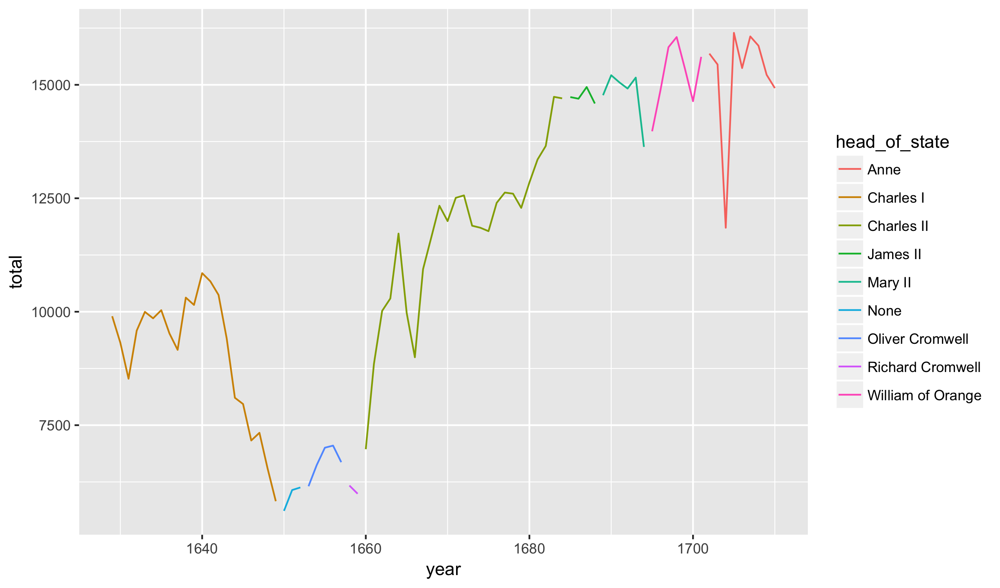

## R Basics

Today we begin our study of using the R programming language to analyze
data. There are two basic philosophies regarding how to teach R: (1) working
from the ground up, methodically going through each function and command one
by one or (2) learning by immersion, starting with short by complete examples
and working backwards to fill in the gaps.

We will start by the immersion method because it is both more interesting
and generally leads to a better understanding of how to do statistical
computing. Throughout the semester we will go back and fill in any remaining
details as needed.

### RStudio

Now, open the RStudio file on the lab computers. Make sure you are opening
RStudio and not R itself. You should see screen like this (its a screen
shot from my Mac, but looks very similar on Windows):

The window on the left hand side is called the **console**. It is the brains
of R. This is where code is actually R by the R engine. Just to get a sense
of how this works, start by writing a simple math equation:


2 + 4



## [1] 6


You should see the result (6) print out on the screen in the console.

### Code files

We can type commands directly into the console but this is generally not
very good practice. A better option is to write code into an Rscript.
This script can then be (1) saved as a file and (2) run automatically
line by line in R. To create a new script click the green plus button in the
upper left-hand corner of RStudio. You should create a new `.R` file and then
will see something like this:

Try typing the algebraic expression into the code file:


2 + 4



## [1] 6


To run these lines, highlight them all and hit the run button on the top of
the editor. This automatically runs the command in the console and prints out
the results.

With R, we save scripts rather than the actual variables and analyses. Save
the `.R`. file somewhere on the Desktop to see how to save it. Close RStudio
and then re-open the code.

### Packages

In addition to the basic R functions that exist for our use on start-up,
there are thousands of user-contributed packages the implement various
add-on functions. Several are already installed on the machines in class.
Instructions for downloaded packages on your own machine are included in
the setup notes.

Once a package is installed, we also need to load it. While installing the
package only needs to be done once, we have to load it each and every time
we restart R. To load the **readr** package, for instance, we would run
the following:


library(readr)


Once loaded, we can run commands from the readr package.

## A short example

### Load packages

Now, let's actually use some R commands to perform a statistical analysis.
Make sure that you are copying these command *first* into a code file and
then running them. The initial step is to load four R packages:


library(readr)
library(dplyr)
library(ggplot2)
library(plotly)


Put these at the top of the script and then leave a blank line before
copying the rest of the code. Run the commands and verify that there are
no errors (R may show messages or warnings; these are generally nothing
to worry about).

### Import and view the data

The next step is to load a dataset into R. Thursday's class will be spent
talking about how to structure our own data; for today, we will work with some
data that I have previously prepared:


births <- read_csv("https://statsmaths.github.io/stat_data/arbuthnot.csv")


Here, we are using the **function** `read_csv` to read in a dataset on my
website. The `<-` symbol has saved this dataset as an **object** called
`births`. Notice that the dataset appears in the environment pane in the upper
right-hand corner of RStudio.

The dataset here shows the number of children born in London on an annual
basis, separated by their sex. Interactively in RStudio, you can see the data
as a table by clicking on the table in the upper right-hand corner.

*Q: What years are included in the study?*

*Q: Where/how do you think this data may have been collected?*

### Plots

Now, let's visualize the dataset by constructing several different plots. To
start, here is the code to produce a plot of the total number of births by
year:


ggplot(births, aes(year, total)) +
  geom_line()


*Q: How would you describe the pattern on births over time?*

It may be helpful to add the head of state for each year of the dataset.


ggplot(births, aes(year, total)) +
  geom_line(aes(color = head_of_state))


*Q: What benefit does the color give to understanding the data?*

*Q: What is one change you'd like to make to the way R has constructed the
plot?*

### Numeric summaries

This dataset was originally designed for studying the secondary sex ratio:
the number of males born in a population divided by the number of females.
We can compute this ratio for the entire run of the dataset in R with the
following:


sum(births$boys) / sum(births$girls)



## [1] 1.067294


We see that there are slightly more males born over the time period (about
7% more) compared to women.

### Assignment

Now that you have seen a short example of using R to read in a dataset and
produce a short analysis, try to see how well you understand the code by
making a few modifications. Along the way, try to understand how these changes
effect the results. I recommend adding to the code you already have rather
than replacing it:

1. I have another dataset on my website called `present.csv` that gives
a present-day version of Arbuthnot dataset for the United States. Read this
into R and save as a dataset called `present`. *Q: What years are covered
here?*
2. Recreate the line chart colored by the head of state for the present day
data. *Q: How would you describe the pattern?*
3. Now, plot just the number of girls born each year rather than the total.
*Q: Does the pattern differ significantly from the total births?*
4. Compute the secondary sex ratio for the US dataset. *Q: How does it
compare to the Arbuthnot data?*
5. Calculate the average number of birth each year in the present-day dataset
(Hint: there is a function called `mean` in R similar to the function `sum`).

Looks like you are already well on your way to learning how to do statistical
analyses in R!

I have also posted notes on the website, called **Class 00**, for installing
R, RStudio and all of the required packages on your own machine. If you plan
on using your own computer in this course, which I highly recommend (you'll
need to write all of the projects using RStudio), please follow this
instructions before the next class. I do not want to be debugging R
installations on the eve of the first project's due date.

