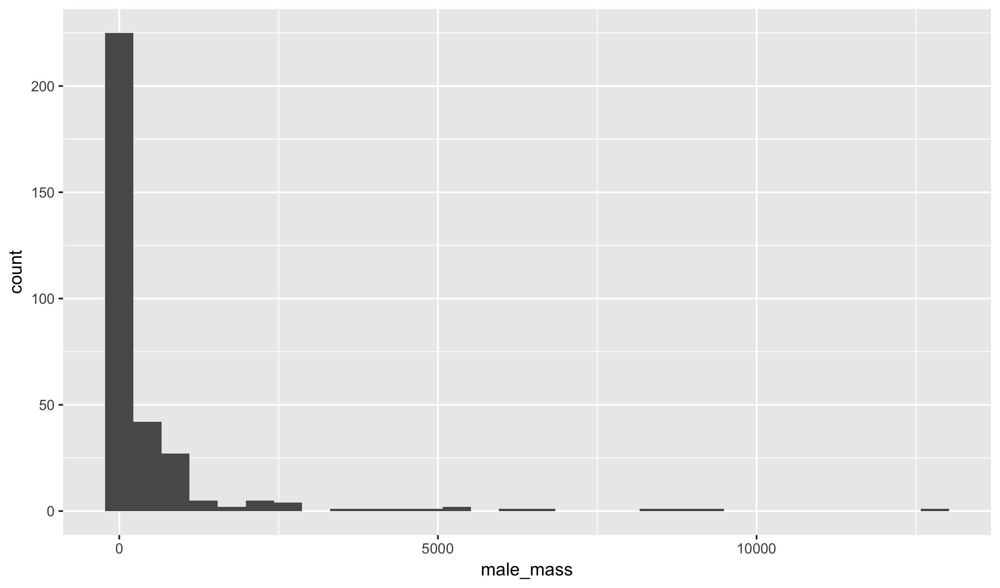
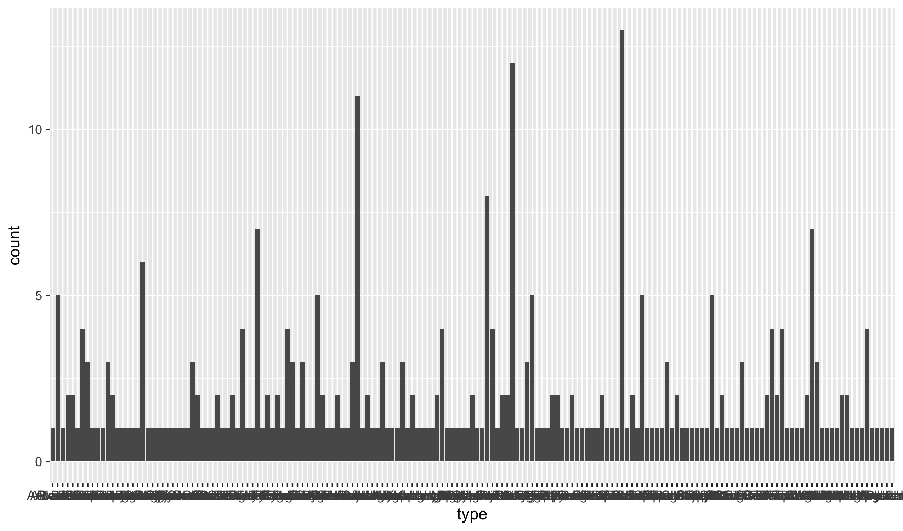
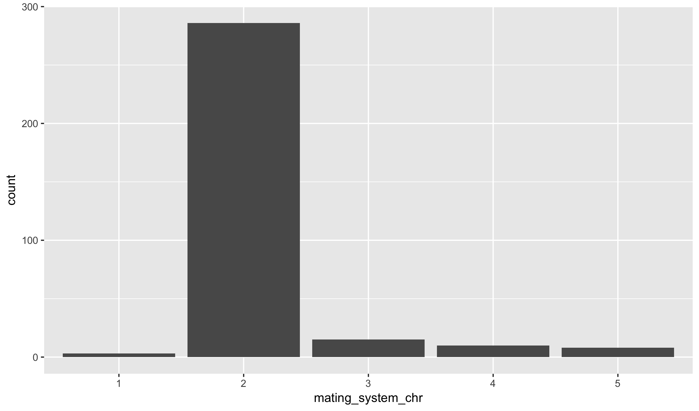

### Variable Types


birds <- read_csv("https://raw.githubusercontent.com/statsmaths/stat_data/gh-pages/birds.csv")

<table class="table table-striped table-hover table-condensed" style="margin-left: auto; margin-right: auto;">
<thead><tr>
<th style="text-align:left;"> genus </th>
   <th style="text-align:left;"> species </th>
   <th style="text-align:left;"> name </th>
   <th style="text-align:left;"> type </th>
   <th style="text-align:right;"> egg_mass </th>
   <th style="text-align:right;"> male_mass </th>
   <th style="text-align:right;"> mating_system </th>
   <th style="text-align:right;"> display </th>
   <th style="text-align:right;"> resource </th>
   <th style="text-align:right;"> clutch_size </th>
  </tr></thead>
<tbody>
<tr>
<td style="text-align:left;"> Acanthagenys </td>
   <td style="text-align:left;"> rufogularis </td>
   <td style="text-align:left;"> Spiny-cheeked </td>
   <td style="text-align:left;"> Honeyeater </td>
   <td style="text-align:right;"> 5.45 </td>
   <td style="text-align:right;"> 47.1 </td>
   <td style="text-align:right;"> 2 </td>
   <td style="text-align:right;"> 3 </td>
   <td style="text-align:right;"> 2 </td>
   <td style="text-align:right;"> 2.20 </td>
  </tr>
<tr>
<td style="text-align:left;"> Acanthisitta </td>
   <td style="text-align:left;"> chloris </td>
   <td style="text-align:left;"> NA </td>
   <td style="text-align:left;"> Rifleman </td>
   <td style="text-align:right;"> 1.34 </td>
   <td style="text-align:right;"> 5.6 </td>
   <td style="text-align:right;"> 2 </td>
   <td style="text-align:right;"> 1 </td>
   <td style="text-align:right;"> 2 </td>
   <td style="text-align:right;"> 4.00 </td>
  </tr>
<tr>
<td style="text-align:left;"> Acanthiza </td>
   <td style="text-align:left;"> chrysorrhoa </td>
   <td style="text-align:left;"> Yellow-rumped </td>
   <td style="text-align:left;"> Thornbill </td>
   <td style="text-align:right;"> 1.44 </td>
   <td style="text-align:right;"> 9.4 </td>
   <td style="text-align:right;"> 2 </td>
   <td style="text-align:right;"> 1 </td>
   <td style="text-align:right;"> 1 </td>
   <td style="text-align:right;"> 3.50 </td>
  </tr>
<tr>
<td style="text-align:left;"> Acanthiza </td>
   <td style="text-align:left;"> ewingii </td>
   <td style="text-align:left;"> Tasmanian </td>
   <td style="text-align:left;"> Thornbill </td>
   <td style="text-align:right;"> 1.46 </td>
   <td style="text-align:right;"> 7.2 </td>
   <td style="text-align:right;"> 2 </td>
   <td style="text-align:right;"> 1 </td>
   <td style="text-align:right;"> 0 </td>
   <td style="text-align:right;"> 3.50 </td>
  </tr>
<tr>
<td style="text-align:left;"> Acanthiza </td>
   <td style="text-align:left;"> lineata </td>
   <td style="text-align:left;"> Striated </td>
   <td style="text-align:left;"> Thornbill </td>
   <td style="text-align:right;"> 1.32 </td>
   <td style="text-align:right;"> 7.6 </td>
   <td style="text-align:right;"> 2 </td>
   <td style="text-align:right;"> 2 </td>
   <td style="text-align:right;"> 0 </td>
   <td style="text-align:right;"> 3.00 </td>
  </tr>
<tr>
<td style="text-align:left;"> Acanthiza </td>
   <td style="text-align:left;"> pusilla </td>
   <td style="text-align:left;"> Brown </td>
   <td style="text-align:left;"> Thornbill </td>
   <td style="text-align:right;"> 1.40 </td>
   <td style="text-align:right;"> 7.4 </td>
   <td style="text-align:right;"> 2 </td>
   <td style="text-align:right;"> 1 </td>
   <td style="text-align:right;"> 2 </td>
   <td style="text-align:right;"> 3.00 </td>
  </tr>
<tr>
<td style="text-align:left;"> Acanthorhynchus </td>
   <td style="text-align:left;"> superciliosus </td>
   <td style="text-align:left;"> Western </td>
   <td style="text-align:left;"> Spinebill </td>
   <td style="text-align:right;"> 1.73 </td>
   <td style="text-align:right;"> 10.5 </td>
   <td style="text-align:right;"> 2 </td>
   <td style="text-align:right;"> 3 </td>
   <td style="text-align:right;"> 1 </td>
   <td style="text-align:right;"> 1.56 </td>
  </tr>
<tr>
<td style="text-align:left;"> Acrocephalus </td>
   <td style="text-align:left;"> arundinaceus </td>
   <td style="text-align:left;"> Great </td>
   <td style="text-align:left;"> Reed-Warbler </td>
   <td style="text-align:right;"> 3.15 </td>
   <td style="text-align:right;"> 32.3 </td>
   <td style="text-align:right;"> 3 </td>
   <td style="text-align:right;"> 3 </td>
   <td style="text-align:right;"> 1 </td>
   <td style="text-align:right;"> 4.00 </td>
  </tr>
<tr>
<td style="text-align:left;"> Aegolius </td>
   <td style="text-align:left;"> funereus </td>
   <td style="text-align:left;"> Boreal </td>
   <td style="text-align:left;"> Owl </td>
   <td style="text-align:right;"> 12.40 </td>
   <td style="text-align:right;"> 101.0 </td>
   <td style="text-align:right;"> 2 </td>
   <td style="text-align:right;"> 3 </td>
   <td style="text-align:right;"> 0 </td>
   <td style="text-align:right;"> 5.29 </td>
  </tr>
<tr>
<td style="text-align:left;"> Agelaius </td>
   <td style="text-align:left;"> phoeniceus </td>
   <td style="text-align:left;"> Red-winged </td>
   <td style="text-align:left;"> Blackbird </td>
   <td style="text-align:right;"> 3.95 </td>
   <td style="text-align:right;"> 57.3 </td>
   <td style="text-align:right;"> 4 </td>
   <td style="text-align:right;"> 4 </td>
   <td style="text-align:right;"> 1 </td>
   <td style="text-align:right;"> 3.28 </td>
  </tr>
</tbody>
</table>

- **genus** (chr): taxonomic rank of the bird
- **species** (chr): scientific species name of the bird
- **name** (chr): common name of the bird
- **type** (chr): common name of the type of bird
- **egg_mass** (dbl): average mass of an egg when laid (grams)
- **male_mass** (dbl): average observed mass of an adult male (grams)
- **mating_system** (int): scores of mating system. Intensity of male-male competition increases from 1 to 5.
    - (1) polyandry
    - (2) monogamy (<5% polygyny)
    - (3) mostly monogamy, but occasional polygyny (5–15% polygyny)
    - (4) mostly polygyny (> 15% polygyny)
    - (5) lek or promiscuous
- **display** (int): mating display agility
    - (1) ground displays only, including displays on trees and bushes
    - (2) ground displays, but with occasional jumps/leaps into the air
    - (3) both ground and non-acrobatic flight displays
    - (4) mainly aerial displays, non-acrobatic
    - (5) mainly aerial displays, acrobatic
- **resource** (int): scores of territoriality and between-mate resource sharing
    - (0) males and females don't share resources and they feed away from their breeding territory
    - (1) males and females share resources on their territory only during the breeding season
    - (2) males and females share resources on their territory all year round.
- **clutch_size** (dbl): average number of eggs produced per clutch

### Simple Plots


qplot(male_mass, egg_mass, data = birds)



qplot(type, data = birds)


### Converting to Levels to Characters


birds$mating_system_chr <- as.character(birds$mating_system)



qplot(mating_system_chr, data = birds)


### Grouping Numeric Data


birds$male_mass_bin <- bin(birds$male_mass)



## Error in bin(birds$male_mass): could not find function "bin"



qplot(male_mass_bin, data = birds)



## Error in eval(aesthetics$x, data, env): object 'male_mass_bin' not found

