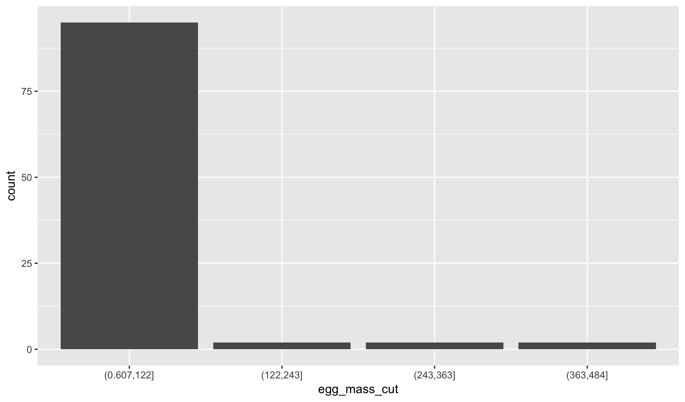

### Variable Types


birds <- read_csv("https://raw.githubusercontent.com/statsmaths/stat_data/gh-pages/birds.csv")

<table class="table table-striped table-hover table-condensed" style="margin-left: auto; margin-right: auto;">
<thead><tr>
<th style="text-align:left;"> genus </th>
   <th style="text-align:left;"> species </th>
   <th style="text-align:left;"> name </th>
   <th style="text-align:left;"> type </th>
   <th style="text-align:right;"> egg_mass </th>
   <th style="text-align:right;"> male_mass </th>
   <th style="text-align:right;"> mating_system </th>
   <th style="text-align:right;"> display </th>
   <th style="text-align:right;"> resource </th>
   <th style="text-align:right;"> clutch_size </th>
  </tr></thead>
<tbody>
<tr>
<td style="text-align:left;"> Acanthagenys </td>
   <td style="text-align:left;"> rufogularis </td>
   <td style="text-align:left;"> Spiny-cheeked </td>
   <td style="text-align:left;"> Honeyeater </td>
   <td style="text-align:right;"> 5.45 </td>
   <td style="text-align:right;"> 47.1 </td>
   <td style="text-align:right;"> 2 </td>
   <td style="text-align:right;"> 3 </td>
   <td style="text-align:right;"> 2 </td>
   <td style="text-align:right;"> 2.20 </td>
  </tr>
<tr>
<td style="text-align:left;"> Aegolius </td>
   <td style="text-align:left;"> funereus </td>
   <td style="text-align:left;"> Boreal </td>
   <td style="text-align:left;"> Owl </td>
   <td style="text-align:right;"> 12.40 </td>
   <td style="text-align:right;"> 101.0 </td>
   <td style="text-align:right;"> 2 </td>
   <td style="text-align:right;"> 3 </td>
   <td style="text-align:right;"> 0 </td>
   <td style="text-align:right;"> 5.29 </td>
  </tr>
<tr>
<td style="text-align:left;"> Aimophila </td>
   <td style="text-align:left;"> ruficeps </td>
   <td style="text-align:left;"> Rufous-crowned </td>
   <td style="text-align:left;"> Sparrow </td>
   <td style="text-align:right;"> 2.90 </td>
   <td style="text-align:right;"> 18.1 </td>
   <td style="text-align:right;"> 2 </td>
   <td style="text-align:right;"> 2 </td>
   <td style="text-align:right;"> 1 </td>
   <td style="text-align:right;"> 3.45 </td>
  </tr>
<tr>
<td style="text-align:left;"> Ammodramus </td>
   <td style="text-align:left;"> bairdii </td>
   <td style="text-align:left;"> Baird's </td>
   <td style="text-align:left;"> Sparrow </td>
   <td style="text-align:right;"> 2.21 </td>
   <td style="text-align:right;"> 18.9 </td>
   <td style="text-align:right;"> 2 </td>
   <td style="text-align:right;"> 2 </td>
   <td style="text-align:right;"> 1 </td>
   <td style="text-align:right;"> 4.55 </td>
  </tr>
<tr>
<td style="text-align:left;"> Anas </td>
   <td style="text-align:left;"> superciliosa </td>
   <td style="text-align:left;"> Pacific Black </td>
   <td style="text-align:left;"> Duck </td>
   <td style="text-align:right;"> 63.00 </td>
   <td style="text-align:right;"> 1059.0 </td>
   <td style="text-align:right;"> 2 </td>
   <td style="text-align:right;"> 2 </td>
   <td style="text-align:right;"> 0 </td>
   <td style="text-align:right;"> 11.00 </td>
  </tr>
<tr>
<td style="text-align:left;"> Aprosmictus </td>
   <td style="text-align:left;"> erythropterus </td>
   <td style="text-align:left;"> Red-winged </td>
   <td style="text-align:left;"> Parrot </td>
   <td style="text-align:right;"> 11.50 </td>
   <td style="text-align:right;"> 134.7 </td>
   <td style="text-align:right;"> 2 </td>
   <td style="text-align:right;"> 3 </td>
   <td style="text-align:right;"> 1 </td>
   <td style="text-align:right;"> 5.00 </td>
  </tr>
<tr>
<td style="text-align:left;"> Asio </td>
   <td style="text-align:left;"> flammeus </td>
   <td style="text-align:left;"> Short-eared </td>
   <td style="text-align:left;"> Owl </td>
   <td style="text-align:right;"> 21.30 </td>
   <td style="text-align:right;"> 278.0 </td>
   <td style="text-align:right;"> 2 </td>
   <td style="text-align:right;"> 5 </td>
   <td style="text-align:right;"> 1 </td>
   <td style="text-align:right;"> 5.60 </td>
  </tr>
<tr>
<td style="text-align:left;"> Asio </td>
   <td style="text-align:left;"> otus </td>
   <td style="text-align:left;"> Long-eared </td>
   <td style="text-align:left;"> Owl </td>
   <td style="text-align:right;"> 23.00 </td>
   <td style="text-align:right;"> 233.0 </td>
   <td style="text-align:right;"> 2 </td>
   <td style="text-align:right;"> 4 </td>
   <td style="text-align:right;"> 0 </td>
   <td style="text-align:right;"> 3.00 </td>
  </tr>
<tr>
<td style="text-align:left;"> Biziura </td>
   <td style="text-align:left;"> lobata </td>
   <td style="text-align:left;"> Musk </td>
   <td style="text-align:left;"> Duck </td>
   <td style="text-align:right;"> 128.00 </td>
   <td style="text-align:right;"> 2398.0 </td>
   <td style="text-align:right;"> 5 </td>
   <td style="text-align:right;"> 1 </td>
   <td style="text-align:right;"> 1 </td>
   <td style="text-align:right;"> 2.80 </td>
  </tr>
<tr>
<td style="text-align:left;"> Calamospiza </td>
   <td style="text-align:left;"> melanocorys </td>
   <td style="text-align:left;"> Lark </td>
   <td style="text-align:left;"> Bunting </td>
   <td style="text-align:right;"> 3.14 </td>
   <td style="text-align:right;"> 36.1 </td>
   <td style="text-align:right;"> 3 </td>
   <td style="text-align:right;"> 4 </td>
   <td style="text-align:right;"> 1 </td>
   <td style="text-align:right;"> 3.72 </td>
  </tr>
</tbody>
</table>

### Schema / Data Dictionary

- **genus** (chr): taxonomic rank of the bird
- **species** (chr): scientific species name of the bird
- **name** (chr): common name of the bird
- **type** (chr): common name of the type of bird
- **egg_mass** (dbl): average mass of an egg when laid (grams)
- **male_mass** (dbl): average observed mass of an adult male (grams)
- **mating_system** (int): scores of mating system. Intensity of male-male competition increases from 1 to 5.
    - (1) polyandry
    - (2) monogamy (<5% polygyny)
    - (3) mostly monogamy, but occasional polygyny (5–15% polygyny)
    - (4) mostly polygyny (> 15% polygyny)
    - (5) lek or promiscuous
- **display** (int): mating display agility
    - (1) ground displays only, including displays on trees and bushes
    - (2) ground displays, but with occasional jumps/leaps into the air
    - (3) both ground and non-acrobatic flight displays
    - (4) mainly aerial displays, non-acrobatic
    - (5) mainly aerial displays, acrobatic
- **resource** (int): scores of territoriality and between-mate resource sharing
    - (0) males and females don't share resources and they feed away from their breeding territory
    - (1) males and females share resources on their territory only during the breeding season
    - (2) males and females share resources on their territory all year round.
- **clutch_size** (dbl): average number of eggs produced per clutch

### Simple Plots


qplot(male_mass, egg_mass, data = birds)



qplot(type, data = birds)


### Converting to Levels to Characters


birds$display_chr <- as.character(birds$display)



qplot(display_chr, data = birds)



table(birds$display_chr)



## 
##  1  2  3  4  5 
## 42 10 35 13  1


### Grouping Numeric Data


birds$egg_mass_cut <- cut(birds$egg_mass, breaks = 4)



qplot(egg_mass_cut, data = birds)



table(birds$display_chr, birds$egg_mass_cut)



##    
##     (0.607,122] (122,243] (243,363] (363,484]
##   1          41         1         0         0
##   2          10         0         0         0
##   3          30         1         2         2
##   4          13         0         0         0
##   5           1         0         0         0

