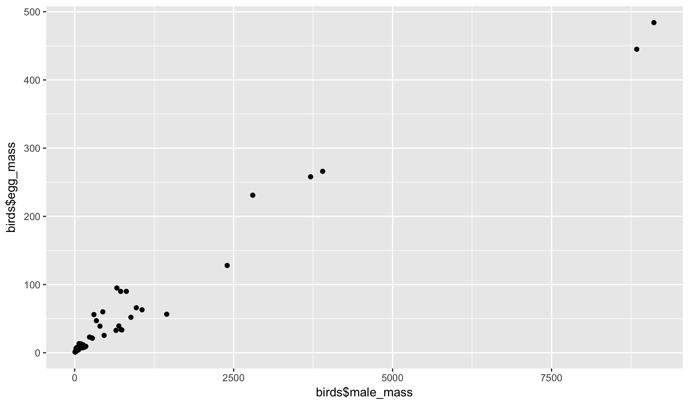
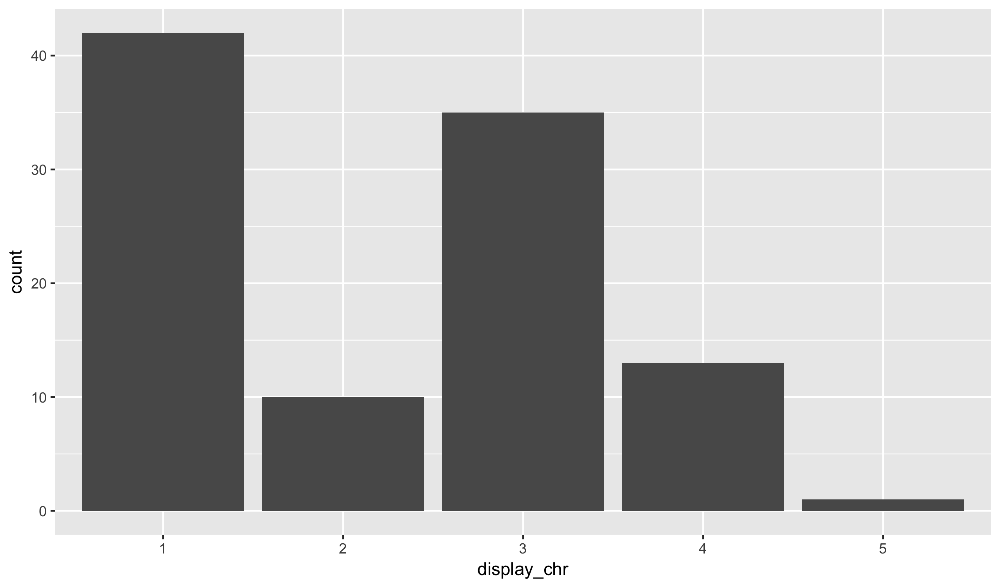

### Variable Types

Variables in R have different *types* depending on the kind of
data that they store. The most common types that you will see
are the following three:

- integers (whole numbers)
- doubles (decimal numbers)
- characters

Mostly, you won't need to worry about the difference between
integers and doubles. R with treat them very similarly. However,
character vectors are handled quite distinctly from numeric
data. There are many other data types that you might encounter;
two other relatively common data types deal with time data:

- dates (day, month, and year)
- date-times (date plus hour, seconds, and possibly sub-second info)

Let's look at a new dataset to see examples of the kinds of data that
can be stored in a data frame:


birds <- read_csv("https://raw.githubusercontent.com/statsmaths/stat_data/gh-pages/birds.csv")

<table class="table table-striped table-hover table-condensed" style="margin-left: auto; margin-right: auto;">
<thead><tr>
<th style="text-align:left;"> genus </th>
   <th style="text-align:left;"> species </th>
   <th style="text-align:left;"> name </th>
   <th style="text-align:left;"> type </th>
   <th style="text-align:right;"> egg_mass </th>
   <th style="text-align:right;"> male_mass </th>
   <th style="text-align:right;"> mating_system </th>
   <th style="text-align:right;"> display </th>
   <th style="text-align:right;"> resource </th>
   <th style="text-align:right;"> clutch_size </th>
  </tr></thead>
<tbody>
<tr>
<td style="text-align:left;"> Acanthagenys </td>
   <td style="text-align:left;"> rufogularis </td>
   <td style="text-align:left;"> Spiny-cheeked </td>
   <td style="text-align:left;"> Honeyeater </td>
   <td style="text-align:right;"> 5.45 </td>
   <td style="text-align:right;"> 47.1 </td>
   <td style="text-align:right;"> 2 </td>
   <td style="text-align:right;"> 3 </td>
   <td style="text-align:right;"> 2 </td>
   <td style="text-align:right;"> 2.20 </td>
  </tr>
<tr>
<td style="text-align:left;"> Aegolius </td>
   <td style="text-align:left;"> funereus </td>
   <td style="text-align:left;"> Boreal </td>
   <td style="text-align:left;"> Owl </td>
   <td style="text-align:right;"> 12.40 </td>
   <td style="text-align:right;"> 101.0 </td>
   <td style="text-align:right;"> 2 </td>
   <td style="text-align:right;"> 3 </td>
   <td style="text-align:right;"> 0 </td>
   <td style="text-align:right;"> 5.29 </td>
  </tr>
<tr>
<td style="text-align:left;"> Aimophila </td>
   <td style="text-align:left;"> ruficeps </td>
   <td style="text-align:left;"> Rufous-crowned </td>
   <td style="text-align:left;"> Sparrow </td>
   <td style="text-align:right;"> 2.90 </td>
   <td style="text-align:right;"> 18.1 </td>
   <td style="text-align:right;"> 2 </td>
   <td style="text-align:right;"> 2 </td>
   <td style="text-align:right;"> 1 </td>
   <td style="text-align:right;"> 3.45 </td>
  </tr>
<tr>
<td style="text-align:left;"> Ammodramus </td>
   <td style="text-align:left;"> bairdii </td>
   <td style="text-align:left;"> Baird's </td>
   <td style="text-align:left;"> Sparrow </td>
   <td style="text-align:right;"> 2.21 </td>
   <td style="text-align:right;"> 18.9 </td>
   <td style="text-align:right;"> 2 </td>
   <td style="text-align:right;"> 2 </td>
   <td style="text-align:right;"> 1 </td>
   <td style="text-align:right;"> 4.55 </td>
  </tr>
<tr>
<td style="text-align:left;"> Anas </td>
   <td style="text-align:left;"> superciliosa </td>
   <td style="text-align:left;"> Pacific Black </td>
   <td style="text-align:left;"> Duck </td>
   <td style="text-align:right;"> 63.00 </td>
   <td style="text-align:right;"> 1059.0 </td>
   <td style="text-align:right;"> 2 </td>
   <td style="text-align:right;"> 2 </td>
   <td style="text-align:right;"> 0 </td>
   <td style="text-align:right;"> 11.00 </td>
  </tr>
<tr>
<td style="text-align:left;"> Aprosmictus </td>
   <td style="text-align:left;"> erythropterus </td>
   <td style="text-align:left;"> Red-winged </td>
   <td style="text-align:left;"> Parrot </td>
   <td style="text-align:right;"> 11.50 </td>
   <td style="text-align:right;"> 134.7 </td>
   <td style="text-align:right;"> 2 </td>
   <td style="text-align:right;"> 3 </td>
   <td style="text-align:right;"> 1 </td>
   <td style="text-align:right;"> 5.00 </td>
  </tr>
<tr>
<td style="text-align:left;"> Asio </td>
   <td style="text-align:left;"> flammeus </td>
   <td style="text-align:left;"> Short-eared </td>
   <td style="text-align:left;"> Owl </td>
   <td style="text-align:right;"> 21.30 </td>
   <td style="text-align:right;"> 278.0 </td>
   <td style="text-align:right;"> 2 </td>
   <td style="text-align:right;"> 5 </td>
   <td style="text-align:right;"> 1 </td>
   <td style="text-align:right;"> 5.60 </td>
  </tr>
<tr>
<td style="text-align:left;"> Asio </td>
   <td style="text-align:left;"> otus </td>
   <td style="text-align:left;"> Long-eared </td>
   <td style="text-align:left;"> Owl </td>
   <td style="text-align:right;"> 23.00 </td>
   <td style="text-align:right;"> 233.0 </td>
   <td style="text-align:right;"> 2 </td>
   <td style="text-align:right;"> 4 </td>
   <td style="text-align:right;"> 0 </td>
   <td style="text-align:right;"> 3.00 </td>
  </tr>
<tr>
<td style="text-align:left;"> Biziura </td>
   <td style="text-align:left;"> lobata </td>
   <td style="text-align:left;"> Musk </td>
   <td style="text-align:left;"> Duck </td>
   <td style="text-align:right;"> 128.00 </td>
   <td style="text-align:right;"> 2398.0 </td>
   <td style="text-align:right;"> 5 </td>
   <td style="text-align:right;"> 1 </td>
   <td style="text-align:right;"> 1 </td>
   <td style="text-align:right;"> 2.80 </td>
  </tr>
<tr>
<td style="text-align:left;"> Calamospiza </td>
   <td style="text-align:left;"> melanocorys </td>
   <td style="text-align:left;"> Lark </td>
   <td style="text-align:left;"> Bunting </td>
   <td style="text-align:right;"> 3.14 </td>
   <td style="text-align:right;"> 36.1 </td>
   <td style="text-align:right;"> 3 </td>
   <td style="text-align:right;"> 4 </td>
   <td style="text-align:right;"> 1 </td>
   <td style="text-align:right;"> 3.72 </td>
  </tr>
</tbody>
</table>

Do any of the data types surprise you? Hopefully not!

### Schema / Data Dictionary

We have already discussed a data dictionary. A schema is simply
a data dictionary that also includes a description of the data
types. Here is a data dictionary of the birds data:

- **genus** (chr): taxonomic rank of the bird
- **species** (chr): scientific species name of the bird
- **name** (chr): common name of the bird
- **type** (chr): common name of the type of bird
- **egg_mass** (dbl): average mass of an egg when laid (grams)
- **male_mass** (dbl): average observed mass of an adult male (grams)
- **mating_system** (int): scores of mating system. Intensity of male-male competition increases from 1 to 5.
    - (1) polyandry
    - (2) monogamy (<5% polygyny)
    - (3) mostly monogamy, but occasional polygyny (5–15% polygyny)
    - (4) mostly polygyny (> 15% polygyny)
    - (5) lek or promiscuous
- **display** (int): mating display agility
    - (1) ground displays only, including displays on trees and bushes
    - (2) ground displays, but with occasional jumps/leaps into the air
    - (3) both ground and non-acrobatic flight displays
    - (4) mainly aerial displays, non-acrobatic
    - (5) mainly aerial displays, acrobatic
- **resource** (int): scores of territoriality and between-mate resource sharing
    - (0) males and females don't share resources and they feed away from their breeding territory
    - (1) males and females share resources on their territory only during the breeding season
    - (2) males and females share resources on their territory all year round.
- **clutch_size** (dbl): average number of eggs produced per clutch

Notice that the last two variables are integer codes. They are
stored as numbers but also correspond to a category. The schema
describes this in detail.

### Plot by Variable Type

One reason that we care about data types is that it changes
the types of plots that we can create. Here is a scatter plot
of two numeric variables:


qplot(birds$male_mass, birds$egg_mass)


And a bar plot of a categorical one:


qplot(type, data = birds)


Other functions related to graphics and modelling also change
based on the type of a variable, so it is quite important to
make a note of these.

### Converting to Characters

We can use the `as.character` function to convert from a number
to a category. For example, here is a bar plot of the display
integer codes:


qplot(as.character(birds$display))


Does it make sense in this context to describe the display variable
as a categorical variable?

### Grouping Numeric Data

We can also use the `cut` function to break a numeric variable into
contiguous groups. We have to specify the number of groups in a second
argument to the function, like this:


qplot(cut(birds$egg_mass, breaks = 4))


The function breaks the range of the numeric variable into equal chunks.
Unlike the `as.character` function, the `cut` function makes sense for
any numeric variable. Would `as.character` be useful on the variable
`egg_mass`?

