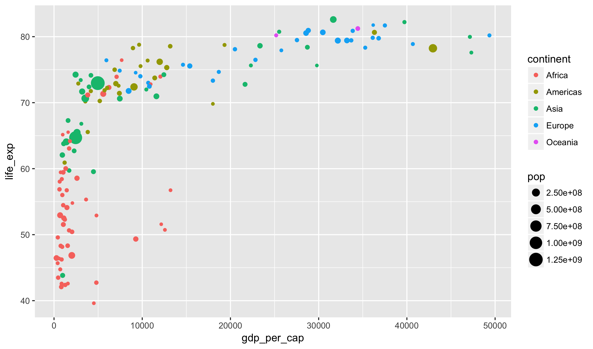
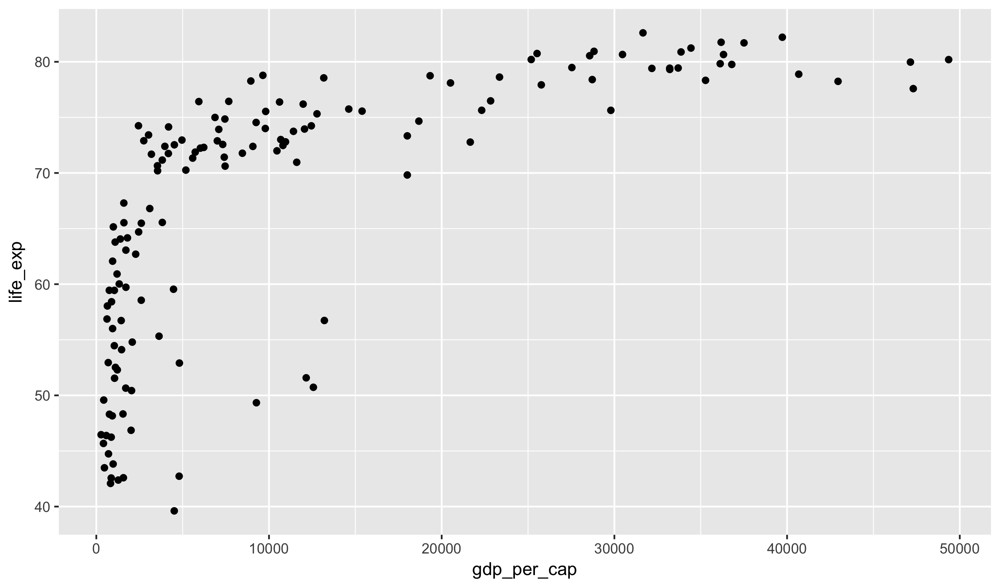
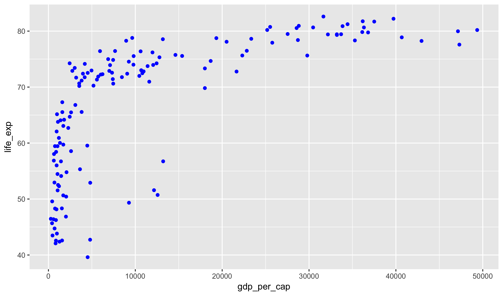
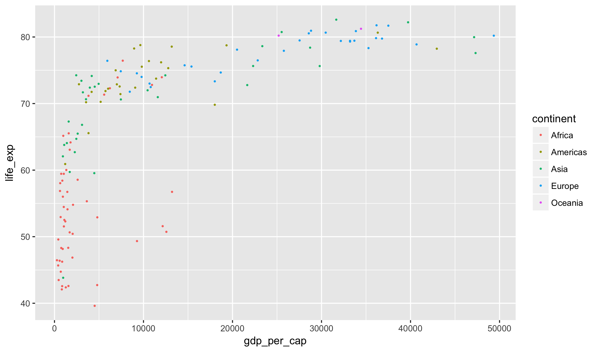
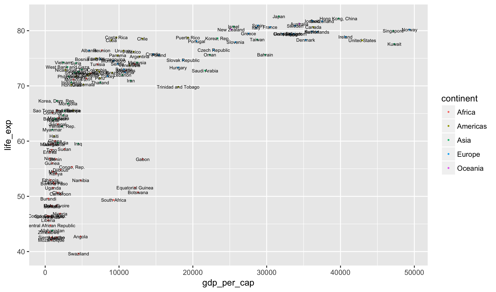
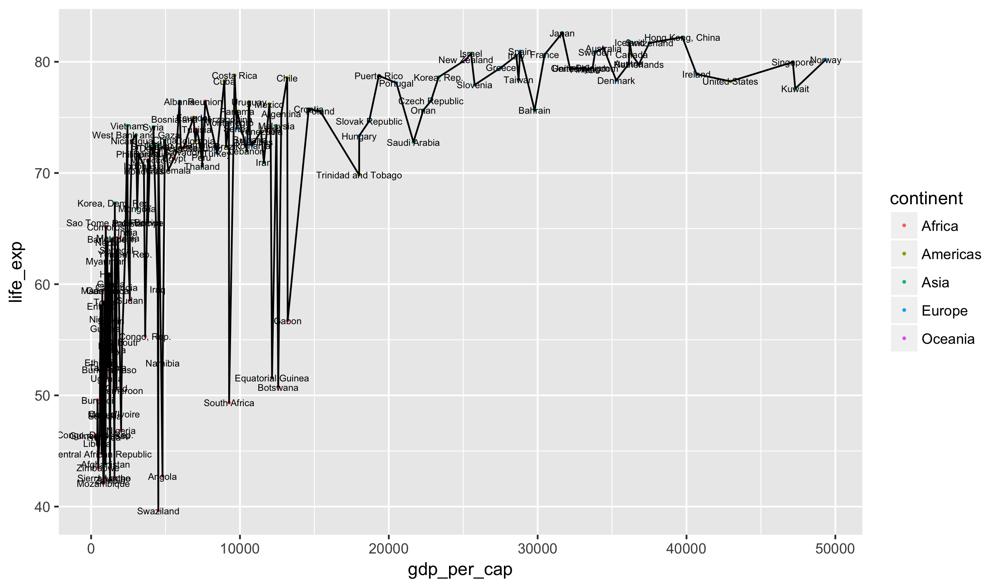

### Grammar of Graphics

As you have seen in examples already, we will be using the **ggplot2** package
for graphics in this course. The `gg` standards for the Grammar of Graphics,
an influential theoretical structure for constructing statistical graphics
created by Leland Wilkinson:

To build a statistical graphic, we will be building different layers that fit
together to produce plots. Each layer requires three elements:

- a geometry describing what type of layer is being added; for example, this
might be a points, lines, or text
- a dataset from which to build the layer
- a mapping from variables in the dataset into elements called aesthetics that
control the way the plot looks

### Example with Hans Roslin's data

To illustrate these points, let's look at a subset of the data that Hans
Roslin used in the video I showed on the first day of class. It contains just
a single year of the data (2007).


gapminder_2007 <- read_csv("https://statsmaths.github.io/stat_data/gapminder_2007.csv")



## Parsed with column specification:
## cols(
##   country = col_character(),
##   continent = col_character(),
##   life_exp = col_double(),
##   pop = col_integer(),
##   gdp_per_cap = col_double()
## )



gapminder_2007



## # A tibble: 142 x 5
##        country continent life_exp       pop gdp_per_cap
##          <chr>     <chr>    <dbl>     <int>       <dbl>
##  1 Afghanistan      Asia   43.828  31889923    974.5803
##  2     Albania    Europe   76.423   3600523   5937.0295
##  3     Algeria    Africa   72.301  33333216   6223.3675
##  4      Angola    Africa   42.731  12420476   4797.2313
##  5   Argentina  Americas   75.320  40301927  12779.3796
##  6   Australia   Oceania   81.235  20434176  34435.3674
##  7     Austria    Europe   79.829   8199783  36126.4927
##  8     Bahrain      Asia   75.635    708573  29796.0483
##  9  Bangladesh      Asia   64.062 150448339   1391.2538
## 10     Belgium    Europe   79.441  10392226  33692.6051
## # ... with 132 more rows


Here is a plot similar to the one that Roslin use (I will show the
code to construct it in just a few moments). Note that R writes the population
key in scientific notation (2.5e+08 is the same as 2.5 time 10 to the power of
eight).

Here, two of our three elements should be clear: dataset is `gapminder_2007`
and the plot uses the points geometry (`geom_point`, which we have already
seen). How do the aesthetic elements function? There are four visible
aesthetics here, each matched to a particular variable in the dataset:

1. the variable `gdp_per_cap` is mapped to the `x`-axis
2. the variable `life_exp` is mapped to the `y`-axis
3. the variable `continent` is mapped to the `color` aesthetic
4. the variable `pop` is mapped to the `size` aesthetic

Notice how each of these is shown in the resulting plot.

### Syntax

How do we write the code that actually produces this plot? Here is the full
code written out in its entirety.


ggplot(data=gapminder_2007, aes(x=gdp_per_cap, y=life_exp)) +
  geom_point(aes(color=continent, size=pop))


Equivalently, we can leave off the names in the first row. R knows by default
that the first parameter should be data, the second is the x-variable, and
the third is the y-variable.


ggplot(gapminder_2007, aes(gdp_per_cap, life_exp)) +
  geom_point(aes(color=continent, size=pop))


Let's dive a bit deeper into what this plot is doing. The first line sets up
a base plot by defining the dataset and indicating which variables are
associated with the x- and y-axes. To this line we add a geometry that lets
R know that we want to include points on this plot. Within the points, we
further want to assign color to change with the continent and size to change
with the population. Note that these latter elements **must** be named;
otherwise R will not know exactly which variables are being mapped to which
aesthetics.

Recall that previously we did not define the color or size of the points.
Leaving this out simply forces R to retain the default size (1) and color
(black):


ggplot(gapminder_2007, aes(gdp_per_cap, life_exp)) +
  geom_point()


In some cases we want to change an aesthetic to a different fixed value than
the default. To do this, we include the specification of the aesthetic
*outside* of the `aes` function. Here are points colored in blue:


ggplot(gapminder_2007, aes(gdp_per_cap, life_exp)) +
  geom_point(color = "blue")


It is possible to mix aesthetics so that some are mapped to variables and
others to fixed values. Simply specify the fixed values outside of the `aes`
function after the variable aesthetics. Here are small points with color
denoting the continent:


ggplot(gapminder_2007, aes(gdp_per_cap, life_exp)) +
  geom_point(aes(color = continent), size = 0.4)


You'll notice that I put the color blue in quotes but left the size
specification as-is. This comes back to the notion of a data type in R. A
fixed color is specified by a character, which has to be contained in quotes,
but a size is given by number, which cannot be. Note: this applies only to a
fixed value, not when assigning something by a variable.

### Layers

The beauty of the grammar of graphics is that we can construct many plots by
combining together simple layers. The `geom_text` is another layer type that
puts a label in place of a point. It requires a new (non-optional) aesthetic
called `label` that describes which variable is used for the label. Here we
see it combined with the points layer:


ggplot(gapminder_2007, aes(gdp_per_cap, life_exp)) +
  geom_point(aes(color = continent), size = 0.4) +
  geom_text(aes(label = country), size = 2)


The top row of the ggplot command gives defaults for the y-axis aesthetic. It
is possible to override this in a particular layer. Why might this be useful?
It might be a good idea to move the country labels slightly below their
respective dots:


ggplot(gapminder_2007, aes(gdp_per_cap, life_exp)) +
  geom_point(aes(color = continent), size = 0.4) +
  geom_text(aes(y = life_exp - 0.5, label = country), size = 2)


Notice that we can modify the variable in-line, such as subtracting a fixed
value from a variable, within the **ggplot2** syntax.

### Practice

We have covered a lot of new commands today. Practicing them is incredibly
important to keeping up with this course. You will not learn how to do these
properly without spending a reasonable amount of time practicing these skills
outside of class. Download the
<a href="https://raw.githubusercontent.com/statsmaths/stat209/master/labs/lab08.Rmd" download="lab08.Rmd" target="_blank">lab08.Rmd</a>
file and work through the exercises.
Upload your script (no need to include the HTML file) to GitHub ahead of the
next class.

