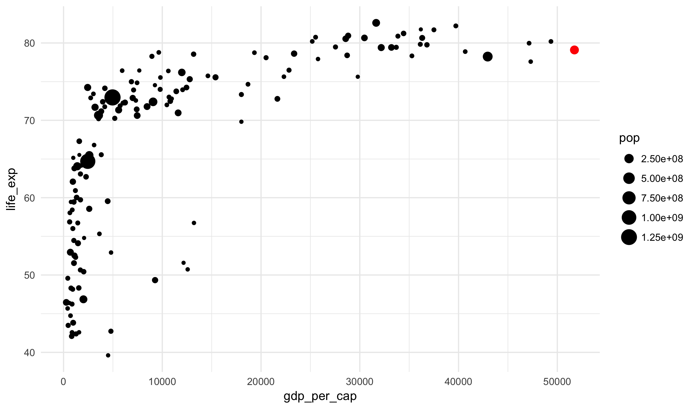
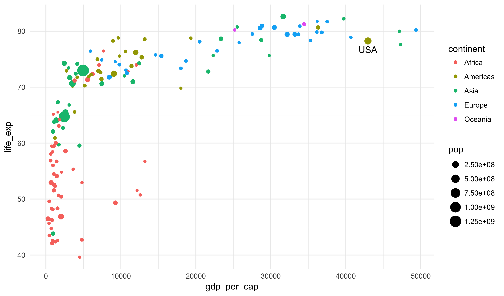
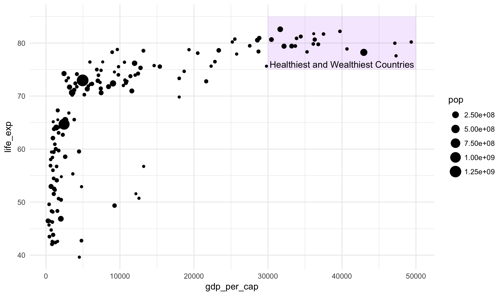

### Learning Objectives

Today we will review the elements of the grammar of graphics and extend
this grammar to allow for manual annotations of data visualizations.

### GapMinder Data

For today's notes, we will once again use the `gapminder_2007` dataset:


gapminder_2007 <- read_csv("https://statsmaths.github.io/stat_data/gapminder_2007.csv")


Here is a plot showing several of the ways that layers and aesthetics can
be used to construct an informative visualization:


ggplot(gapminder_2007, aes(gdp_per_cap, life_exp)) +
  geom_point(aes(size = pop), color = "salmon")


I have changed the size of the points to scale with the population, but the
color of the points is set to a fixed value.

## Labels

As you saw in `lab08.Rmd`, we can add labels to the plot by adding
new layers to the plot:

- `xlab("text for the x-axis")`
- `ylab("text for the y-axis")`
- `ggtitle("text for the title/top of the plot")`
- `labs(size = "label for the size legend")`

Let's add these to the current plot: 


ggplot(data=gapminder_2007, aes(x=gdp_per_cap, y=life_exp)) +
  geom_point(aes(size=pop), color = "salmon") +
  xlab("Gross domestic product per capita (USD)") +
  ylab("Life expectancy at birth (years)") +
  labs(size = "Population") +
  ggtitle("Macroeconomic variables by country (2007)")


Do not feel that you need to add complex labels to plots as we are doing
an exploratory analysis. However, when presenting plots in a report these
should certainly be used to clarify the plot to the audience or readers.

### Annotations

While we can use graphics simply for our own exploratory work, they can
often also be used to make visual arguments. That's the case, for example,
whenever we use a graphic in a report or presentation. In order to strengthen
a visual argument it is useful to add manual annotations to the plot to help
explain our main points.

In order to add manual annotations, we will use the function `annotate`.
For each annotation, simply add another layer. The exact syntax differs
based on whether we want a point:


annotate("point", x = [X COORDINATE], y = [Y COORDINATE], [OTHER OPTIONS])


Text:


annotate("text", x = [X COORDINATE], y = [Y COORDINATE], label = [TEXT],
         [OTHER OPTIONS])


Or a rect(angle):


annotate("text", xmin = [VALUE], xmax = [VALUE], ymin = [VALUE],
                 ymax = [VALUE], [OTHER OPTIONS])


For example, to add the current life expectancy (79.1) and GDP (51736) of Virginia
onto the plot, I would do this:


ggplot(data=gapminder_2007, aes(x=gdp_per_cap, y=life_exp)) +
  geom_point(aes(size=pop)) +
  annotate("point", x = 51736, y = 79.1, color = "red", size = 3)


Similarly, I could label the US on the plot:


ggplot(data=gapminder_2007, aes(x=gdp_per_cap, y=life_exp)) +
  geom_point(aes(size=pop, color = continent)) +
  annotate("text", x = 42950, y = 767, label = "USA")


Or, highlight the healthy and wealthy part of the plot:


ggplot(data=gapminder_2007, aes(x=gdp_per_cap, y=life_exp)) +
  annotate("rect", xmin = 30000, xmax = 50000,
                   ymin = 75, ymax = 83,
                   fill = "purple", alpha = 0.1) +
  geom_point(aes(size=pop)) +
  annotate("text", x = 40000, y = 76,
           label = "Healthiest and Wealthiest Countries")


Notice here that I set the aesthetics `fill` (that the filled color
of the rectangle) and `alpha` (how opaque the rectangle is); I also
put the rectangle first so that the points were plotted behind the
rectangle.

### Practice

We will, once again, work on a lab for the remainder of the class:
<a href="https://raw.githubusercontent.com/statsmaths/stat209/master/labs/lab09.Rmd" download="lab09.Rmd" target="_blank">lab09.Rmd</a>
Upload your script (no need to include the HTML file) to GitHub ahead of the
next class.

