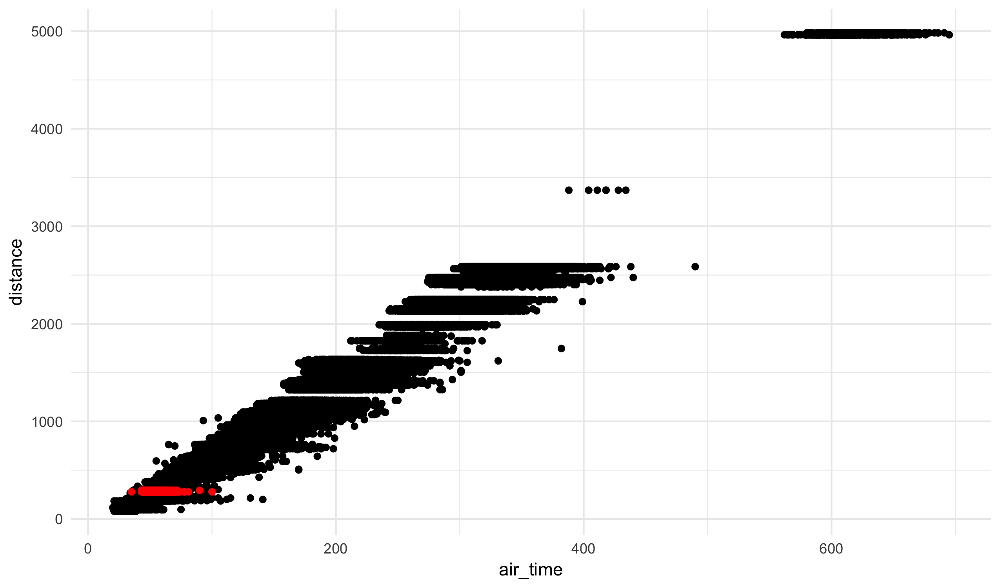

### Learning Objectives

Today we will discuss how to construct new datasets as a subset of a current
dataset.

### NYC Flights Data

Often is will be useful to take a subset of a dataset. This can be useful
if we are only interested in a particular part of the dataset; it can also
be used if we want to create one visualization layers that highlights where
one subset of data lies within another.

To illustrate how this works, today we will explore a dataset of the every
commercial flight that departed from New York City in 2013 (we'll use this
many times as it is a great teaching sample):


flights <- read_csv("https://statsmaths.github.io/stat_data/flights.csv")



## Parsed with column specification:
## cols(
##   year = col_integer(),
##   month = col_integer(),
##   day = col_integer(),
##   dep_time = col_integer(),
##   sched_dep_time = col_integer(),
##   dep_delay = col_integer(),
##   arr_time = col_integer(),
##   sched_arr_time = col_integer(),
##   arr_delay = col_integer(),
##   carrier = col_character(),
##   flight = col_integer(),
##   tailnum = col_character(),
##   origin = col_character(),
##   dest = col_character(),
##   air_time = col_integer(),
##   distance = col_integer(),
##   hour = col_integer(),
##   minute = col_integer(),
##   time_hour = col_datetime(format = "")
## )



flights



## # A tibble: 327,346 x 19
##     year month   day dep_time sched_dep_time dep_delay arr_time
##    <int> <int> <int>    <int>          <int>     <int>    <int>
##  1  2013     1     1      517            515         2      830
##  2  2013     1     1      533            529         4      850
##  3  2013     1     1      542            540         2      923
##  4  2013     1     1      544            545        -1     1004
##  5  2013     1     1      554            600        -6      812
##  6  2013     1     1      554            558        -4      740
##  7  2013     1     1      555            600        -5      913
##  8  2013     1     1      557            600        -3      709
##  9  2013     1     1      557            600        -3      838
## 10  2013     1     1      558            600        -2      753
## # ... with 327,336 more rows, and 12 more variables: sched_arr_time <int>,
## #   arr_delay <int>, carrier <chr>, flight <int>, tailnum <chr>,
## #   origin <chr>, dest <chr>, air_time <int>, distance <int>, hour <int>,
## #   minute <int>, time_hour <dttm>


We will discuss a few different ways of taking a subset of the data, termed
**filtering**, before showing how this approach can integrated into other
analyses.

### Filtering data

The general syntax for filtering data in R is to use the following, where
expression is a logical statement about variables in the dataset `OLD`:


NEW <- filter(OLD, EXPRESSION)


For example, to find flights where the departure time is greater than
2300 (the times are in a 24 hour format):


flights_new <- filter(flights, dep_time > 2300)
flights_new



## # A tibble: 2,573 x 19
##     year month   day dep_time sched_dep_time dep_delay arr_time
##    <int> <int> <int>    <int>          <int>     <int>    <int>
##  1  2013     1     1     2302           2200        62     2342
##  2  2013     1     1     2306           2245        21       28
##  3  2013     1     1     2307           2245        22       32
##  4  2013     1     1     2310           2255        15       24
##  5  2013     1     1     2312           2000       192       21
##  6  2013     1     1     2323           2200        83       22
##  7  2013     1     1     2326           2130       116      131
##  8  2013     1     1     2327           2250        37       32
##  9  2013     1     1     2343           1724       379      314
## 10  2013     1     1     2353           2359      -  6      425
## # ... with 2,563 more rows, and 12 more variables: sched_arr_time <int>,
## #   arr_delay <int>, carrier <chr>, flight <int>, tailnum <chr>,
## #   origin <chr>, dest <chr>, air_time <int>, distance <int>, hour <int>,
## #   minute <int>, time_hour <dttm>


Notice that the new dataset has only 2573 rows, much smaller than the starting
dataset. Similar expressions exist for other numeric comparisons: `<` (less
than), `>=` (greater than or equal), and `<=` (less than or equal). Similarly
we can compare whether one variable is exactly equal to a particular value.
For this we need to use `==`, not a single equal sign:


flights_exact <- filter(flights, dep_time == 2300)
flights_exact



## # A tibble: 64 x 19
##     year month   day dep_time sched_dep_time dep_delay arr_time
##    <int> <int> <int>    <int>          <int>     <int>    <int>
##  1  2013     1     5     2300           2229        31      352
##  2  2013     1     6     2300           2245        15       14
##  3  2013     1    13     2300           2039       141      357
##  4  2013     1    16     2300           2253         7       19
##  5  2013     1    30     2300           2030       150       23
##  6  2013    10     9     2300           2159        61       15
##  7  2013    10    18     2300           2245        15        7
##  8  2013    10    22     2300           2255         5       17
##  9  2013    11     8     2300           2245        15       16
## 10  2013    11    25     2300           2145        75      155
## # ... with 54 more rows, and 12 more variables: sched_arr_time <int>,
## #   arr_delay <int>, carrier <chr>, flight <int>, tailnum <chr>,
## #   origin <chr>, dest <chr>, air_time <int>, distance <int>, hour <int>,
## #   minute <int>, time_hour <dttm>


Here we have flights that only take off *exactly* at 11pm. The symbol `!=`
detects whether a value is **not** equal to a particular value:


flights_not_december <- filter(flights, month != 12)
flights_not_december



## # A tibble: 300,326 x 19
##     year month   day dep_time sched_dep_time dep_delay arr_time
##    <int> <int> <int>    <int>          <int>     <int>    <int>
##  1  2013     1     1      517            515         2      830
##  2  2013     1     1      533            529         4      850
##  3  2013     1     1      542            540         2      923
##  4  2013     1     1      544            545        -1     1004
##  5  2013     1     1      554            600        -6      812
##  6  2013     1     1      554            558        -4      740
##  7  2013     1     1      555            600        -5      913
##  8  2013     1     1      557            600        -3      709
##  9  2013     1     1      557            600        -3      838
## 10  2013     1     1      558            600        -2      753
## # ... with 300,316 more rows, and 12 more variables: sched_arr_time <int>,
## #   arr_delay <int>, carrier <chr>, flight <int>, tailnum <chr>,
## #   origin <chr>, dest <chr>, air_time <int>, distance <int>, hour <int>,
## #   minute <int>, time_hour <dttm>


The `==` and `!=` symbols also work for character and date variables, however
you'll need to make sure to enclose the comparison value (not the variable) in
quotation marks:


flights_to_rva <- filter(flights, dest == "RIC")
flights_to_rva



## # A tibble: 2,346 x 19
##     year month   day dep_time sched_dep_time dep_delay arr_time
##    <int> <int> <int>    <int>          <int>     <int>    <int>
##  1  2013     1     1     1505           1310       115     1638
##  2  2013     1     1     1859           1900      -  1     2012
##  3  2013     1     1     1938           1703       155     2109
##  4  2013     1     1     2115           2110         5     2240
##  5  2013     1     2      859            845        14     1035
##  6  2013     1     2     1352           1310        42     1509
##  7  2013     1     2     1525           1525         0     1723
##  8  2013     1     2     1810           1703        67     1948
##  9  2013     1     2     1940           1900        40     2052
## 10  2013     1     2     2119           2110         9     2227
## # ... with 2,336 more rows, and 12 more variables: sched_arr_time <int>,
## #   arr_delay <int>, carrier <chr>, flight <int>, tailnum <chr>,
## #   origin <chr>, dest <chr>, air_time <int>, distance <int>, hour <int>,
## #   minute <int>, time_hour <dttm>


We can detect whether a variable is equal to a set of values using the `%in%`
and `c` functions:


flights_summer <- filter(flights, month %in% c(7, 8, 9))
flights_dc_metro <- filter(flights, month %in% c("DCA", "IAD", "BWI"))


These approaches here should get you through most of your needs in filtering
datasets. Anything else can be gotten by making use of the `&` (and),
`|` (or), and `!` (negation). Do not worry about these now; if you have a
need to use them on a project or lab I will show you then.

### Graphing filtered data

If you want to just use the filtered data, this can be done straightforwardly
in R by simply specifying the correct dataset in the first parameter of the
`ggplot` command. But what if you want to use a subset of the data in only
one plot?

Within `geom` layer we can override the `data = ` option to use a different
dataset than specified in the first line. I recommend putting this as the end
of the geom layer:


ggplot(flights, aes(air_time, distance)) +
  geom_point() +
  geom_point(color = "red", data = flights_to_rva)


This shows all of the Richmond flights in red on top of the remainder of the
flights. Combined with annotations, these techniques can create very
professional looking graphics.

### Practice

We will, once again, work on a lab for the remainder of the class:
<a href="https://raw.githubusercontent.com/statsmaths/stat209/master/labs/lab10.Rmd" download="lab10.Rmd" target="_blank">lab10.Rmd</a>
Upload your script to GitHub ahead of the next class.

