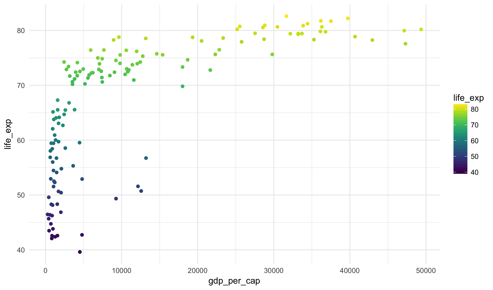

### Learning Objectives

Today we will cover several remaining layer types and examples in the grammar
of graphics.

### GapMinder Data

For the final time, we'll make use the gapminder dataset:


gapminder_2007 <- read_csv("https://statsmaths.github.io/stat_data/gapminder_2007.csv")


### Facets

A special layer type within the **ggplot2** framework, facets allow us
to produce many small plots for each value of a character variable. It
can be added onto almost any other plot.


ggplot(gapminder_2007, aes(gdp_per_cap, life_exp)) +
  geom_point() +
  facet_wrap(~continent)


Notice that the scales of the axes are all the same. Sometimes this is
useful, but in other cases it is useful to allow these to change. We
can do this by adding the option `scales="free"`:


ggplot(gapminder_2007, aes(gdp_per_cap, life_exp)) +
  geom_point() +
  facet_wrap(~continent, scales = "free") + scale_color_viridis(option = "A")


There are also options `scales="free_x"` and `scales="free_y"` if you
would like to only allow one axis to change.

### Scales

Another layer type are scales. These control the exact way that aesthetics
are mapped to visual features. For example, we have seen that we can change
the color pallet used with the **viridis** package:


ggplot(gapminder_2007, aes(gdp_per_cap, life_exp)) +
  geom_point(aes(color = life_exp)) +
  scale_color_viridis()


Similarly, we can add `scale_x_log10()` and/or `scale_y_log10()` to plot
values on the logarithmic scale:


ggplot(gapminder_2007, aes(gdp_per_cap, life_exp)) +
  geom_point(aes(color = life_exp)) +
  scale_color_viridis() +
  scale_x_log10(breaks = c(500, 5000, 50000))


There are a lot of things you can do with the scale functions by changing
the default options:


ggplot(gapminder_2007, aes(gdp_per_cap, life_exp)) +
  geom_point(aes(color = life_exp)) +
  scale_color_viridis() +
  scale_x_log10(breaks = c(500, 5000, 50000)) +
  scale_y_continuous(breaks = c(40, 60, 80))


I won't quiz you on the details of these, but look back to these notes when
you find ourself wanting to do something with the scales or range of the
plot.

### Interactive plots

There exists a very handy package called **plotly** for making interactive
plots from **ggplot2** graphics. Simply load the package:


library(plotly)


Then, in order to make an interactive plot just call `ggplotly` after the
plot has been made:


ggplot(gapminder_2007, aes(gdp_per_cap, life_exp)) +
  geom_point(aes(color = continent, size = pop)) +
  scale_x_log10(breaks = c(500, 5000, 50000)) +
  scale_y_continuous(breaks = c(40, 60, 80))

ggplotly()


If you scroll over the points, you will be able to see any variables mapped
to an aesthetic. The difficulty here is that you will not see variables that
are not mapped to an aesthetic.


ggplot(gapminder_2007, aes(gdp_per_cap, life_exp, fake = country)) +
  geom_point(aes(color = continent, size = pop)) +
  scale_x_log10(breaks = c(500, 5000, 50000)) +
  scale_y_continuous(breaks = c(40, 60, 80))

ggplotly()


Such interactive plots are, as you can image, excellent for exploratory analyses.
However, they do become clunky when working with large datasets and are often
not ideal for integration into a paper or presentation.

### Practice

For today's class, we will work on:
<a href="https://raw.githubusercontent.com/statsmaths/stat209/master/labs/lab10.Rmd" download="lab10.Rmd" target="_blank">lab10.Rmd</a>.

Upload your script (no need to include the HTML file) to GitHub ahead of the
next class.

