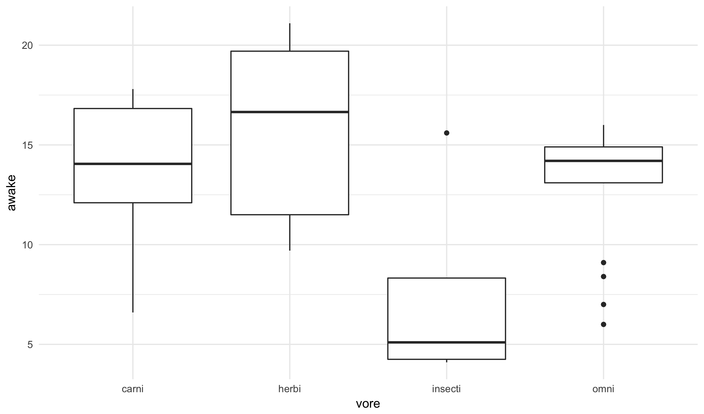

## Objectives

Develop tools for summarizing a dataset numerically, and how we can use these
summaries to produce interesting new visualizations.

## Motivation

Graphics are an excellent way of summarizing and
presenting information contained in a dataset. In many cases it
can be useful to combine these with purely numeric summaries.
These summaries are something colloquially called *statistics*,
though I prefer to avoid this terminology.

In these notes, I will use the `msleep` dataset
in order to show various numerical summaries. Here is an example of
the dataset:


msleep



## # A tibble: 43 x 9
##    name     genus  vore  order sleep_total sleep_rem awake brainwt  bodywt
##    <chr>    <chr>  <chr> <chr>       <dbl>     <dbl> <dbl>   <dbl>   <dbl>
##  1 Owl mon… Aotus  omni  Prim…       17.0      1.80   7.00 1.55e⁻² 4.80e⁻¹
##  2 Greater… Blari… omni  Sori…       14.9      2.30   9.10 2.90e⁻⁴ 1.90e⁻²
##  3 Cow      Bos    herbi Arti…        4.00     0.700 20.0  4.23e⁻¹ 6.00e⁺²
##  4 Dog      Canis  carni Carn…       10.1      2.90  13.9  7.00e⁻² 1.40e⁺¹
##  5 Goat     Capri  herbi Arti…        5.30     0.600 18.7  1.15e⁻¹ 3.35e⁺¹
##  6 Guinea … Cavis  herbi Rode…        9.40     0.800 14.6  5.50e⁻³ 7.28e⁻¹
##  7 Chinchi… Chinc… herbi Rode…       12.5      1.50  11.5  6.40e⁻³ 4.20e⁻¹
##  8 Star-no… Condy… omni  Sori…       10.3      2.20  13.7  1.00e⁻³ 6.00e⁻²
##  9 African… Crice… omni  Rode…        8.30     2.00  15.7  6.60e⁻³ 1.00e⁺⁰
## 10 Lesser … Crypt… omni  Sori…        9.10     1.40  14.9  1.40e⁻⁴ 5.00e⁻³
## # ... with 33 more rows


Each row corresponds to a type of mammal, and gives basic numeric values
that describe their sleeping cycles.

## Mean

The first statistical summary that most people learn about is the **mean**,
also commonly known as an average. It is calculated by adding all of a
variables values together and dividing by the total number of values. If
we have a dataset of n points with a variable x (denoting x with an underscore
1 as the first value, with a 2 as the second, and so forth), the mean can be
formally defined as:

$$ \begin{align*}
\text{mean}(x) &= \overline{x}\\
&= \frac{x_1 + x_2 + \cdots x_n}{n} \\
&= \frac{1}{n} \cdot \sum_i x_i
\end{align*} $$

The notation of using x with a line above it to represent the mean is very common
throughout the sciences and social sciences. It is often used in textbooks
and papers without even being defined. To calculate means in R, as we have
already, seen we can use the `mean` function. Here is an illustration that
`mean` behaves as expected using the `sum` and `nrow` functions for
comparison.


mean(msleep$awake)



## [1] 13.59302



sum(msleep$awake) / nrow(msleep)



## [1] 13.59302


Note, I am showing in the second line a description of what the mean is doing
and verifying that it works. Do **not** coyp and use the second form in your
work.

## Quantiles

Also here are a number of functions that allow us to compute quantiles,
a generalization of percentiles. For example, the `deciles` function splits
the dataset into $10$ equally sized buckets:


deciles(msleep$awake)



##    0%   10%   20%   30%   40%   50%   60%   70%   80%   90%  100% 
##  4.10  6.68  9.90 11.50 13.86 14.20 14.66 15.60 17.70 19.42 21.10


This shows that about 1/2 of the mammals are awake less than 13.90 hours and about
1/2 are awake more than 13.90. I use the word "about" here due to subtitles
regarding ties and repeated values; for all practical purposes this is generally not
important. Note that the 50% percentile has a special name that you have probably heard
before: the *median*.

Similarly, we see that roughly 1/10 of the mammals are
awake less than 8.12 hours and 1/10 are awake less than 20.8 hours. We also see
that the sleepiest mammal is awake for only 4.1 hours and that one mammal is awake
22.1 hours of the day.

We can similarly calculate what are called quartiles, spliting the data into
four equally  using the `quartiles` function:


quartiles(msleep$awake)



##    0%   25%   50%   75%  100% 
##  4.10 11.25 14.20 15.85 21.10


Notice that four buckets requires 5 numbers, and that three of these line up with
the deciles above. There are also functions `ventiles` (20) and `percentiles` that
can be quite useful:


percentiles(msleep$awake)



##     0%     1%     2%     3%     4%     5%     6%     7%     8%     9% 
##  4.100  4.184  4.268  4.716  5.388  5.910  5.952  5.994  6.216  6.468 
##    10%    11%    12%    13%    14%    15%    16%    17%    18%    19% 
##  6.680  6.848  7.056  7.644  8.232  8.610  8.904  9.184  9.436  9.688 
##    20%    21%    22%    23%    24%    25%    26%    27%    28%    29% 
##  9.900 10.110 10.392 10.728 11.040 11.250 11.460 11.500 11.500 11.500 
##    30%    31%    32%    33%    34%    35%    36%    37%    38%    39% 
## 11.500 11.524 12.028 12.532 12.812 12.980 13.172 13.424 13.676 13.776 
##    40%    41%    42%    43%    44%    45%    46%    47%    48%    49% 
## 13.860 13.900 13.900 13.900 13.900 13.900 13.996 14.122 14.200 14.200 
##    50%    51%    52%    53%    54%    55%    56%    57%    58%    59% 
## 14.200 14.242 14.284 14.326 14.368 14.420 14.504 14.588 14.600 14.600 
##    60%    61%    62%    63%    64%    65%    66%    67%    68%    69% 
## 14.660 14.786 14.900 14.900 14.900 14.960 15.044 15.170 15.380 15.590 
##    70%    71%    72%    73%    74%    75%    76%    77%    78%    79% 
## 15.600 15.600 15.624 15.666 15.724 15.850 15.976 16.578 17.292 17.700 
##    80%    81%    82%    83%    84%    85%    86%    87%    88%    89% 
## 17.700 17.702 17.744 17.786 18.052 18.430 18.700 18.700 18.700 19.042 
##    90%    91%    92%    93%    94%    95%    96%    97%    98%    99% 
## 19.420 19.688 19.856 20.012 20.096 20.180 20.424 20.718 20.932 21.016 
##   100% 
## 21.100


Ventiles are a bit esoteric, but I have found in my work that they can be very
useful in practice. Percentiles are often useful when we want to look at the
extreme values, such as the 97th, 98th and 99th percentiles.

## Deviation

Once we have defined the mean, we can then define the **deviation** of a
data value as the difference between the value and its mean:

$$ \begin{align*}
d_1 &= x_1 - \overline{x} \\
d_2 &= x_2 - \overline{x} \\
&\vdots \\
d_n &= x_n - \overline{x}
\end{align*} $$

There is not a special R function for deviances because they are very
easy to calculate using the `mean` function. As an example, here is how
to create them:


msleep$awake - mean(msleep$awake)


Typically we will not need deviances themselves, but they are useful for
understanding variation about a mean.

## Variance

We can use deviations to measure the spread of a variable by adding the
squared values of deviances. Why squares? For one thing, squaring the value
makes negative deviations positive; though, same effect would come from applying
the absolution value function. The specific reason specifically for choosing the
square is a bit too technical for our discussion.

The sume of squared deviances are calculated by the following formula:

$$ \begin{align*}
\text{sum of squares} &= (x_1 - \overline{x})^2 + (x_2 - \overline{x})^2 + \cdots (x_n - \overline{x})^2 \\
&= \sum_i (x_i - \overline{x})^2
\end{align*} $$

And can be computed in R as:


sum((msleep$awake - mean(msleep$awake))^2)



## [1] 842.7279


The sum of squares cannot be used directly to compare datasets
of different sizes as it grows with the number of points. In order to compare
sums of squares across datasets, we use a measurement called **variance**
which is basically just the average of the sums of squares:

$$ \begin{align*}
\text{variance} &= s^2 \\
&= \frac{(x_1 - \overline{x})^2 + (x_2 - \overline{x})^2 + \cdots (x_n - \overline{x})^2}{n - 1} \\
&= \frac{1}{n - 1} \cdot \sum_i (x_i - \overline{x})^2
\end{align*} $$

The notation of using $s^2$ to represent the variance of a dataset is quite common.

Why do we use $n-1$ rather than $n$ to take the average? The technical reason is that
if we want to measure the variance of a population using a sample from that population,
we need to use $n-1$ in order to have an unbiased estimate of the population value...
The short answer is not to worry about it, which I strongly suggest at this point.

The variance can be computed manually as follows:


sum((msleep$awake - mean(msleep$awake))^2) / (nrow(msleep) - 1)



## [1] 20.06495


Or, using the `var` function, or manually as follows:


var(msleep$awake)



## [1] 20.06495


Note: like the `mean` function, you should **only** use the `var` function
in your work. I show the other form simply as a demonstration of the definition.

## Standard deviation

We often work with a quantity called the **standard deviation**, defined as
simply the square root of the variance.

Why bother taking the square root? For one thing, it is a matter of units. In
our example, the variance is given in "squared people" (a nearly meaningless
quantity), but the standard deviation is given in "people" just like the variable
itself. We can calculate the standard deviation for the awake variable using the
function `sd`:


sd(msleep$awake)



## [1] 4.479392


More interestingly, we can drag out the `group_summarize` function to compute the
standard deviation of the awake variable by the type of mammal:


food_type <- group_summarize(msleep, vore)
ggplot(food_type, aes(vore, awake_sd)) +
  geom_point(size = 3)


Where we see that omnivores have more consistent hours spent sleeping and insectivores
have the largest variation of sleeping hours per day.

## Graphing Variation

Finally, we can use these measurments of distribution and variation in graphical
forms. Typically, this comes up when we have a grouping categorical variable and 
another numeric variable of interest.

A boxplot shows, for each group on the x-axis, the distribution of the variable 
on the y-axis. The solid bar indicates the y-axis variable's median and the height
of the box and the "whiskers" indicate measurments of variation (see the link
[boxplot](https://en.wikipedia.org/wiki/Box_plot) for more information about the
different ways these can be computed).


ggplot(msleep, aes(vore, awake)) +
  geom_boxplot()


Similarly, a violin plot is a newer twist on the boxplot that attempts to show
more details about the distribution by varying its width with the distribution
of the points:


ggplot(msleep, aes(vore, awake)) +
  geom_violin()


### Practice

We will work on the next lab for the remainder of the class:
<a href="https://raw.githubusercontent.com/statsmaths/stat209/master/labs/lab17.Rmd" download="lab17.Rmd" target="_blank">lab17.Rmd</a>

Please upload your script to GitHub ahead of the next class.

