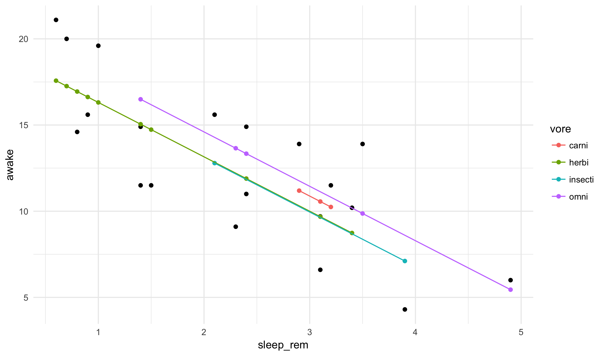

## Objectives

In these notes we extend the inference ideas from the previous two classes to
the relationship between two continuous variables.

## Two continuous variables

We have seen how to use the `lm_basic` function to fit models for the
mean of some response. We have used both a single mean for the entire
dataset as well as multiple means based on a second categorical variable.
What happens if we use the same set-up but instead use a numeric variable
to predict the value of some response? The output is surprisingly similar,
but the interpretation of the results differ slightly.

As an example, let's predict the amount each mammal is awake as a function
of its brain weight:


model <- lm_basic(awake ~ 1 + sleep_rem, data = msleep)
reg_table(model, level = 0.95)



## 
## Call:
## lm_basic(formula = awake ~ 1 + sleep_rem, data = msleep)
## 
## Residuals:
##     Min      1Q  Median      3Q     Max 
## -3.8330 -2.7505  0.1404  2.5230  4.7062 
## 
## Coefficients:
##             Estimate  2.5 % 97.5 %
## (Intercept)   19.426 16.466  22.39
## sleep_rem     -2.923 -4.077  -1.77
## 
## Residual standard error: 2.91 on 18 degrees of freedom
## Multiple R-squared:  0.6115,	Adjusted R-squared:  0.5899 
## F-statistic: 28.33 on 1 and 18 DF,  p-value: 4.642e-05


There is once again an intercept term and a row of the table corresponding
to the new variable `brainwt`. What do these numbers mean? It turns out
that this is simply describing a best-fit line through the data. We have
already seen how to do this graphically with `geom_smooth`. The line here
is, exactly, the line given in this plot:


qplot(sleep_rem, awake, data = msleep) + geom_smooth(method = "lm")


The `reg_table` function is just giving us the intercept and slope of
this line, along with confidence interval bounds for both. Does it make
sense that the slope here is negative? It should!

This should explain why the first term is called the intercept. As with
the discrete case, there is a special meaning behind whether the confidence
interval contains zero. If it does not, we say we have detected a
statistically significant linear relationship between our two variables.

## Multiple linear regression

Further, and finally, we can add multiple variables into a single regression.
It is even possible to mix continuous and categorical variables into the
same model:


model <- lm_basic(awake ~ 1 + sleep_rem + vore, data = msleep)
reg_table(model, level = 0.95)



## 
## Call:
## lm_basic(formula = awake ~ 1 + sleep_rem + vore, data = msleep)
## 
## Residuals:
##    Min     1Q Median     3Q    Max 
## -4.554 -2.459  0.285  2.716  4.034 
## 
## Coefficients:
##             Estimate   2.5 % 97.5 %
## (Intercept)  20.3459 14.2320 26.460
## sleep_rem    -3.1563 -4.7079 -1.605
## voreherbi    -0.8790 -5.8266  4.069
## voreinsecti  -0.9271 -6.9977  5.144
## voreomni      0.5673 -4.2954  5.430
## 
## Residual standard error: 3.12 on 15 degrees of freedom
## Multiple R-squared:  0.628,	Adjusted R-squared:  0.5288 
## F-statistic: 6.331 on 4 and 15 DF,  p-value: 0.003432


The interpretation becomes, in this case, the change we would expect to
see in the response given a *marginal* change in one of the explanatory
variables on the right-hand side of the model. That is, how do we expect
the mean to change if we modify one (and only one) of the other variables.
We could spend a lot of time focusing on this distinction, but I don't want
to go too far down this line of thinking.

## Fitted Values

As models become more complex it can become difficult to directly compute
the predicted values and residuals that come from it. We can use the
`add_prediction` function in R to append the residuals back into the original
dataset.


model <- lm_basic(awake ~ 1 + sleep_rem, data = msleep)
msleep <- add_prediction(msleep, model)
msleep



## # A tibble: 20 x 13
##    name   genus vore  order conservation sleep_total sleep_rem sleep_cycle
##    <chr>  <chr> <chr> <chr> <chr>              <dbl>     <dbl>       <dbl>
##  1 Great… Blar… omni  Sori… lc                 14.9      2.30        0.133
##  2 Cow    Bos   herbi Arti… domesticated        4.00     0.700       0.667
##  3 Dog    Canis carni Carn… domesticated       10.1      2.90        0.333
##  4 Guine… Cavis herbi Rode… domesticated        9.40     0.800       0.217
##  5 Chinc… Chin… herbi Rode… domesticated       12.5      1.50        0.117
##  6 Lesse… Cryp… omni  Sori… lc                  9.10     1.40        0.150
##  7 Long-… Dasy… carni Cing… lc                 17.4      3.10        0.383
##  8 North… Dide… omni  Dide… lc                 18.0      4.90        0.333
##  9 Big b… Epte… inse… Chir… lc                 19.7      3.90        0.117
## 10 Horse  Equus herbi Peri… domesticated        2.90     0.600       1.00 
## 11 Europ… Erin… omni  Erin… lc                 10.1      3.50        0.283
## 12 Domes… Felis carni Carn… domesticated       12.5      3.20        0.417
## 13 Golde… Meso… herbi Rode… en                 14.3      3.10        0.200
## 14 House… Mus   herbi Rode… nt                 12.5      1.40        0.183
## 15 Rabbit Oryc… herbi Lago… domesticated        8.40     0.900       0.417
## 16 Labor… Ratt… herbi Rode… lc                 13.0      2.40        0.183
## 17 Easte… Scal… inse… Sori… lc                  8.40     2.10        0.167
## 18 Thirt… Sper… herbi Rode… lc                 13.8      3.40        0.217
## 19 Pig    Sus   omni  Arti… domesticated        9.10     2.40        0.500
## 20 Brazi… Tapi… herbi Peri… vu                  4.40     1.00        0.900
## # ... with 5 more variables: awake <dbl>, brainwt <dbl>, bodywt <dbl>,
## #   model_pred <dbl>, model_resid <dbl>


It also adds in the predicted values for each data point. These predictions
are often called the **fitted values**. We can see what this is doing with
a simple plot:


ggplot(msleep, aes(sleep_rem, awake)) +
  geom_point() +
  geom_point(aes(y = model_pred), color = "orange")


As you can see, the predicted values all line along a single line.

### Practice

We will work on the next lab for the remainder of the class:
<a href="https://raw.githubusercontent.com/statsmaths/stat209/master/labs/lab20.Rmd" download="lab20.Rmd" target="_blank">lab20.Rmd</a>

Please upload your script to GitHub ahead of the next class.

