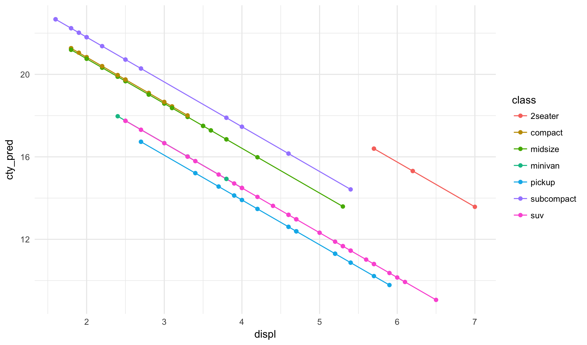
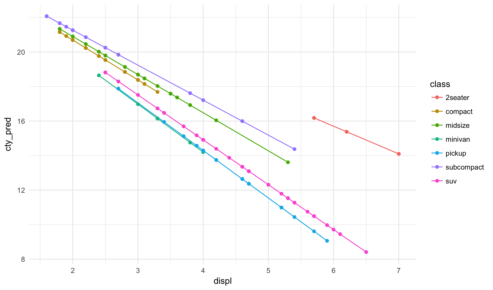

## Objectives

Today we will cover some miscellaneous R functions for constructing different
types of models beyond those that fit into the class proper.

## Multivariate regression with categorical data

### Cars Dataset

Today we are, once again, going to look at our automobiles dataset:


cars <- read_csv("https://statsmaths.github.io/stat_data/mpg.csv")


Our goal today is to estimate the city fuel efficiency of each car.

### Categorical predictors

It would be reasonable to start with a regression model
that uses `displ` to predict the response variable.
We can just as easily add categorical data into our
model. Next week we will cover the specifics of what
is internally being done here, but for now let's just
see what adding the `class` variable to the model does
to the output:


model <- lm(cty ~ displ + class,
            data = cars)
cars$cty_pred <- predict(model, newdata = cars)
model



## 
## Call:
## lm(formula = cty ~ displ + class, data = cars)
## 
## Coefficients:
##     (Intercept)            displ     classcompact     classmidsize  
##          28.777           -2.172           -3.599           -3.676  
##    classminivan      classpickup  classsubcompact         classsuv  
##          -5.595           -6.182           -2.629           -5.599


Notice that it appears that we now have a separate term for
each class of car. If you look more carefully you'll see that
there is no mention of "2seater" in the list. This value is
excluded because otherwise we would have perfect collinearity
between the variables (a violation of the model assumptions)

The model created here can be thought of as a set of parallel
lines, one for each class of car. We can see that here:


ggplot(cars, aes(displ, cty_pred)) +
  geom_line(aes(color = class)) +
  geom_point(aes(color = class))


Notice, for example, that compact and midsize have very close
estimates in the regression model and very close lines on the
plot.

Here, we have different offsets for each class but the same slope.
It is possible, easy in fact, to have different slopes and the same
intercept. We simply use the `:` sign instead of the `+` sign in
the formula specification.


model <- lm(cty ~ displ:class,
            data = cars)
cars$cty_pred <- predict(model, newdata = cars)
model



## 
## Call:
## lm(formula = cty ~ displ:class, data = cars)
## 
## Coefficients:
##           (Intercept)     displ:class2seater     displ:classcompact  
##                25.316                 -1.602                 -2.311  
##    displ:classmidsize     displ:classminivan      displ:classpickup  
##                -2.208                 -2.779                 -2.755  
## displ:classsubcompact         displ:classsuv  
##                -2.026                 -2.601


Here, the model gives the difference between each classes slope and
the baseline slope.


ggplot(cars, aes(displ, cty_pred)) +
  geom_line(aes(color = class)) +
  geom_point(aes(color = class))


Finally, we could use a `*` in place of the `:` to have different slopes
and intercepts.

## Extensions to the linear model

### Generalized linear models

There are many other functions in R that have similar calling
mechanisms to `lm` but run different underlying models.

For example, `glm` fits generalized linear models. These can
be used, amongst other things, for fitting a model to a binary
response. The *logit* model assumes the following relationship
between the response y and the inputs x:

$$ \frac{\mathbb{P}[y_i = 1]}{1 - \mathbb{P}[y_i = 1]} = \alpha + x_{1,i} \beta_1 + \cdots + x_{p,i} \beta_p  $$

Which is often simplified using the logit function itself:

$$ \text{logit}(\mathbb{P}[Y_i = 1]) = \alpha + x_{1,i} \beta_1 + \cdots + x_{p,i} \beta_p $$

Fitting the model is easy; we just use `glm` and specify the
binomial model:


df <- data_frame(y = c(0,0,0,0,1,1,1,1), x = rnorm(8))
model <- glm(y ~ x, data = df, family = binomial())
summary(model)



## 
## Call:
## glm(formula = y ~ x, family = binomial(), data = df)
## 
## Deviance Residuals: 
##     Min       1Q   Median       3Q      Max  
## -1.6833  -0.9773   0.1293   0.9952   1.3974  
## 
## Coefficients:
##             Estimate Std. Error z value Pr(>|z|)
## (Intercept)   0.5134     0.8834   0.581    0.561
## x             1.2924     1.1654   1.109    0.267
## 
## (Dispersion parameter for binomial family taken to be 1)
## 
##     Null deviance: 11.0904  on 7  degrees of freedom
## Residual deviance:  9.3434  on 6  degrees of freedom
## AIC: 13.343
## 
## Number of Fisher Scoring iterations: 4


It is much harder, impossible perhaps, to fully understand the
meaning of the coefficents (though we can make sense of the
difference between it being negative, postive, and zero). To
get predictions - which we will describe as the probability
that y is equal to 1 - we would need to apply the inverse
logit function:

$$ \mathbb{P}[Y_i = 1] = \text{logit}^{-1} (\alpha + x_{1,i} \beta_1 + \cdots + x_{p,i} \beta_p) $$

Be careful, because the `predict` by default returns the linear
combination of the inputs without the inverse logit transformation.
Notice here that the range is not between zero and one:


df$pred <- predict(model, newdata = df)
quantile(df$pred)



##            0%           25%           50%           75%          100% 
## -2.4274107098 -0.5062779084  0.0003435112  0.6243476584  1.3802826210


To get the predicted probabilities, we need to add an option to
the predict function:


df$pred <- predict(model, newdata = df, type = "response")
quantile(df$pred)



##         0%        25%        50%        75%       100% 
## 0.08110623 0.37606709 0.50008217 0.64785231 0.79903639


Of course, we could also apply the inverse logit function
ourselves, but that is more error prone and needs to be
changed depending on the "family" choosen for the logistic
regression.

### Robust linear models

In the **MASS** package (included with all standard R
installations) is the `rlm` function for fitting robust
linear regression:


library(MASS)



## 
## Attaching package: 'MASS'



## The following object is masked from 'package:dplyr':
## 
##     select



x <- rnorm(100)
y <- 1 + x + rnorm(100, sd = 0.2)
y[50] <- 1e4
model_lm <- lm(y ~ x)
model_rlm <- rlm(y ~ x)


We see that the robust version is much more accurate than
the standard regression function in this case:


summary(model_lm)



## 
## Call:
## lm(formula = y ~ x)
## 
## Residuals:
##    Min     1Q Median     3Q    Max 
## -272.6 -140.0  -89.7  -43.4 9844.3 
## 
## Coefficients:
##             Estimate Std. Error t value Pr(>|t|)
## (Intercept)   112.97     101.51   1.113    0.268
## x             -74.31     101.54  -0.732    0.466
## 
## Residual standard error: 1002 on 98 degrees of freedom
## Multiple R-squared:  0.005436,	Adjusted R-squared:  -0.004713 
## F-statistic: 0.5356 on 1 and 98 DF,  p-value: 0.466



summary(model_rlm)



## 
## Call: rlm(formula = y ~ x)
## Residuals:
##        Min         1Q     Median         3Q        Max 
## -5.708e-01 -1.440e-01 -2.756e-03  1.237e-01  1.000e+04 
## 
## Coefficients:
##             Value   Std. Error t value
## (Intercept)  1.0440  0.0206    50.6944
## x            0.9940  0.0206    48.2503
## 
## Residual standard error: 0.1895 on 98 degrees of freedom


### Other models

If you have a need for a specific model, you can usually
find an R package that support it. In most cases, the model
will roughly resemble calling `lm`.

Some common examples you may run into:

- `gam::gam` for generalized additive models
- `nls` for non-linear regression
- `lme4::lmer` for mixed effects models
- `quantreg::qr` for quantila regression
- `glmnet::glmnet` for the generalized elastic net
- `randomforest::randomforest` for random forest classifications
- `forcast::auto.arima` for modeling time series

### Thoughts on statistical inference

I am personally quite sceptical of p-values from large linear models.
Here is an excellent demo showing how easy *p-hacking* is:

[Hack Your Way To Scientific Glory](https://fivethirtyeight.com/features/science-isnt-broken/#part1)

In general, in order to be valid hypothesis tests, we need to decide
on the exact model before seeing any of the data and only run one
model on the dataset. While we can run more models and modify them
as we observe results, these can only be used for exploratory purposes.

